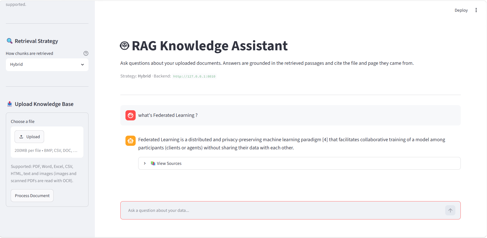

# RAG-KNOWLEDGE-ASSISTANT

`rag-knowledge-assistant` ingests a knowledge base, indexes it, and answers user questions with exact citations. It supports multiple retrieval strategies, automatically evaluates answer quality, and runs entirely via Docker.



**Real‑world usage scenarios**
- Internal company wiki Q&A
- Customer support bot that cites documentation
- Research assistant that answers from papers
- Compliance chatbot answering policy questions with traceable sources

---

## Tech Stack

Backend
- FastAPI

Vector Database
- Qdrant

Metadata
- PostgreSQL

Queue
- Redis + ARQ

Embedding
- Sentence Transformers

LLM
- Ollama

Frontend
- Streamlit

Evaluation
- RAGAS

---

## 🚀 Quick Start (One Command)

```bash
docker-compose up --build
```

This starts:
- **Qdrant** (vector DB)
- **PostgreSQL** (metadata + FTS)
- **Redis** (job queue)
- **Ollama** (local LLM)
- **FastAPI** (backend)
- **arq Worker** (async ingestion)
- **Streamlit UI** (frontend)

Then open:
- **UI:** http://localhost:8501
- **API Docs:** http://localhost:8000/docs
- **Health Check:** http://localhost:8000/api/v1/health → `{"status":"ok"}`

> **Note on OCR:** the API and worker images do **not** ship the Tesseract engine,
> so images and scanned PDFs are rejected until you add it. See
> [OCR Setup](#-ocr-setup-images--scanned-pdfs).

---

## ✨ Features

- **Multi‑Format Ingestion** – PDF, Word, Excel, CSV, HTML, text and images, with table structure preserved as Markdown.
- **Hybrid Retrieval** – Combines dense (Qdrant) and sparse (PostgreSQL FTS) search using Reciprocal Rank Fusion (RRF).
- **Advanced Query Rewriting** – HyDE (Hypothetical Document Embeddings) and Multi-Query expansion.
- **Cross‑Encoder Reranking** – Re-ranks top candidates with a `ms-marco-MiniLM-L-6-v2` cross‑encoder for higher precision.
- **Local LLM Integration** – Uses Ollama (llama3.1:8b) for fully offline, privacy‑friendly generation.
- **Citation‑Grounded Answers** – Every answer includes source document IDs, and the prompt enforces “I don’t know” for out‑of‑context queries.
- **Async Ingestion** – Upload documents and let the background worker process them without blocking the UI.
- **Deduplication & Quality Scoring** – Prevents duplicate chunks and filters low‑quality content.
- **Evaluation Suite** – RAGAS metrics (faithfulness, answer relevancy, context precision, recall) with a dedicated dashboard.
- **LangSmith Observability** – Full tracing of retrieval and generation steps.
- **Modern Streamlit UI** – Chat interface with file upload, real‑time job status, and source citation display.

---

## 📄 Supported Formats

| Group | Extensions | Notes |
|-------|------------|-------|
| **PDF** | `.pdf` | Text layer and tables; pages without a text layer are rasterized and read with **OCR**. |
| **Word** | `.docx` | Paragraphs, headings and tables (legacy `.doc` is routed to the same loader and fails with a clear message). |
| **Excel** | `.xlsx`, `.xlsm`, `.xls` | One unit per sheet, tables as Markdown. |
| **CSV** | `.csv` | Single unit, rendered as a Markdown table. |
| **HTML** | `.html`, `.htm` | Block structure and tables. |
| **Text** | `.txt`, `.md`, `.markdown` | Verbatim. |
| **Image** | `.png`, `.jpg`, `.jpeg`, `.tif`, `.tiff`, `.bmp`, `.webp`, `.gif` | Read with **OCR** (always requires Tesseract). |

The authoritative list is served by `GET /api/v1/formats`, which also reports
whether OCR is usable — the UI reads it so the upload widget always matches the
backend. Unsupported types are rejected with `415` before a job is queued, and
uploads are capped at 200 MB (`MAX_UPLOAD_BYTES`).

---

## 🗂️ Project Structure

```
rag-knowledge-assistant/
├── .env.example                          # Environment variables template
├── README.md                             # This file
├── AGENTS.md                             # Contributor / agent instructions
├── requirements.in                       # Loose dependencies
├── requirements.lock                     # Pinned dependencies with hashes
├── pytest.ini                            # Test paths and markers
├── docker-compose.yml                    # Orchestrates all services
├── infra/
│   ├── Dockerfile.api                        # API container
│   ├── Dockerfile.worker                     # Worker container
│   └── Dockerfile.ui                         # UI container
│
├── src/
│   ├── config/
│   │   ├── config.py                     # Loads YAML and exports CONFIG constants
│   │   └── config.yaml                   # Central configuration
│   ├── ingestion/
│   │   ├── chunker.py                    # Sentence-aware chunking with overlap
│   │   ├── cleaning.py                   # Text normalisation before chunking
│   │   ├── data_pipeline.py              # load_pipeline() for the API
│   │   ├── deduplicated.py               # Exact hash deduplication (Redis)
│   │   ├── embedder.py                   # SentenceTransformer (all-MiniLM-L6-v2)
│   │   ├── indexer.py                    # Qdrant vector indexer
│   │   ├── sparse_store.py               # PostgreSQL FTS table (tsvector + GIN)
│   │   ├── worker.py                     # arq worker for async ingestion
│   │   └── loaders/                      # One loader per format
│   │       ├── __init__.py               # load_document() dispatcher + registry
│   │       ├── pdf.py                    # PyMuPDF text, tables, rasterization
│   │       ├── docx.py                   # python-docx paragraphs, headings, tables
│   │       ├── excel.py                  # openpyxl / csv readers
│   │       ├── text_loaders.py           # .txt / .md / HTML
│   │       ├── markdown.py               # Markdown table helpers
│   │       ├── image.py                  # Image formats (OCR)
│   │       ├── ocr.py                    # Tesseract via pytesseract
│   │       ├── capabilities.py           # Runtime capability detection
│   │       ├── interface.py              # LoadedPage contract
│   │       └── exceptions.py             # Loader error types
│   ├── retrieval/
│   │   ├── dense_retriever.py            # Qdrant vector search
│   │   ├── sparse_retriever.py           # PostgreSQL full-text search (ts_rank)
│   │   ├── hybrid_retriever.py           # RRF fusion of dense + sparse
│   │   ├── hyde_retriever.py             # Hypothetical Document Embeddings
│   │   └── multi_query_retriever.py      # Multi-query expansion with RRF
│   ├── reranking/
│   │   └── cross_encoder_reranker.py     # Cross-encoder reranking
│   ├── generation/
│   │   ├── generator.py                  # Prompt builder + Ollama LLM caller
│   │   └── citations.py                  # Citation formatting helpers
│   ├── evaluation/
│   │   ├── ragas_evaluator.py            # RAGAS evaluation harness
│   │   └── metrics.py                    # Metric aggregation
│   ├── api/
│   │   ├── main.py                       # FastAPI application entrypoint
│   │   ├── models.py                     # Pydantic request/response models
│   │   └── routes/
│   │       ├── query.py                  # /api/v1/query endpoint
│   │       ├── ingest.py                 # /api/v1/ingest endpoint
│   │       └── status.py                 # /api/v1/formats and /api/v1/job/{job_id}
│   ├── ui/
│   │   ├── app.py                        # Streamlit frontend (calls FastAPI)
│   │   └── app_dashboard.py              # Streamlit evaluation dashboard
│   └── utils/
│       └── helper_func.py                # load_pages() and shared helpers
│
├── scripts/
│   ├── test_e2e.py                       # End-to-end smoke test
│   ├── e2e_live_test.py                  # Live API + worker end-to-end test
│   ├── run_ragas_evaluation.py           # Runs RAGAS evaluation for all modes
│   ├── benchmark_latency.py              # Per-stage latency and token baseline
│   ├── verify_ingestion.py               # Checks every supported file format
│   ├── seed_demo_corpus.py               # Seeds the demo corpus (data/demo_documents)
│   ├── seed_golden_corpus.py             # Seeds the RAGAS golden set
│   ├── validate_golden.py                # Validates golden .jsonl files
│   ├── init_qdrant_collection.py         # Creates the Qdrant collection
│   ├── smoke_test_ui.py                  # UI smoke test
│   ├── measure_answers.py                # Answer-quality measurements
│   └── start_worker.sh                   # Starts the arq worker
│
├── tests/
│   ├── unit/                             # Unit tests
│   └── integration/                      # Integration tests
│
├── data/
│   ├── demo_documents/                   # Demo corpus, in every supported format
│   └── evaluation/
│       ├── golden.jsonl                  # Golden dataset for RAGAS
│       ├── golden_demo.jsonl             # Golden set for the demo corpus
│       ├── metrics.csv                   # Aggregated evaluation results
│       └── per_sample.csv                # Per-question results
│
├── docs/
│   ├── architecture.md                   # Component and data-flow notes
│   └── ROADMAP.md                        # Planned work
│
├── assets/
│   └── demo1.png                         # UI screenshot
└── uploads/                              # Temporary upload directory (created at runtime)
```

---

## 🚀 Installation (Manual – Without Docker)

If you prefer to run without Docker:

**1. Clone the repository**
```bash
git clone https://github.com/DangXiMi/RAG-Assistant
cd rag-knowledge-assistant
```

**2. Set up a virtual environment**
```bash
python -m venv venv
source venv/bin/activate  # On Windows: venv\Scripts\activate
```

**3. Install pip-tools and sync dependencies**
```bash
pip install pip-tools
pip-sync requirements.lock
```

To update dependencies after editing requirements.in:
```bash
pip-compile --generate-hashes -o requirements.lock requirements.in
pip-sync requirements.lock
```

> **Multi-format ingestion dependencies.** `pymupdf`, `openpyxl` and
> `pytesseract` are declared in `requirements.in` but are not yet in the pinned
> `requirements.lock`. Because `pip-sync` removes anything the lock does not
> list, install the lock first and then add the loader extras:
> ```bash
> pip install "pymupdf>=1.24" openpyxl==3.1.5 pytesseract==0.3.13
> ```
> Regenerating the lock with the `pip-compile` command above is the durable fix.

**4. Configure environment variables**
```bash
cp .env.example .env
# Edit .env with your PostgreSQL, Qdrant, and LangSmith credentials.
```

> The environment defaults already match the `docker run` flags in step 5, so a
> local run works without any overrides. Note that the API (`src.api.main:app`)
> and the worker do **not** read `.env`; export real environment variables if you
> need to change a host, port or `TESSERACT_CMD`.

**5. Start backing services**
```bash
docker run -d --name qdrant -p 6333:6333 qdrant/qdrant
docker run -d --name postgres -p 5432:5432 -e POSTGRES_USER=raglab -e POSTGRES_PASSWORD=raglab -e POSTGRES_DB=rag_metadata postgres:15
docker run -d --name redis -p 6379:6379 redis:7
docker run -d --name ollama -p 11434:11434 ollama/ollama
ollama pull llama3.1:8b
```

**6. Start the API and worker**
```bash
uvicorn src.api.main:app --reload
arq src.ingestion.worker.WorkerSettings
```

**7. Start the UI**
```bash
streamlit run src/ui/app.py
```

The UI finds the backend automatically: it honours `BACKEND_URL`, otherwise it
probes `http://localhost:8010` (where `scripts/` start the API) and then
`http://localhost:8000`, and reports "Not reachable" in the sidebar when neither
answers.

**8. Optional – install Tesseract for OCR**

Needed only for images and scanned PDFs. See
[OCR Setup](#-ocr-setup-images--scanned-pdfs) below.

---

## 🖼️ OCR Setup (Images & Scanned PDFs)

OCR is optional and degrades gracefully: without it every other format still
ingests, and the UI shows *"OCR unavailable, so images and scanned PDFs cannot be
read."* Two things are required, and the app checks both:

1. the `pytesseract` Python wrapper (installed in step 3 above), and
2. the **Tesseract engine binary**, which `pytesseract` shells out to.

**Install the engine**

| Platform | Command |
|----------|---------|
| Windows | `winget install UB-Mannheim.TesseractOCR` |
| Debian/Ubuntu | `sudo apt-get install tesseract-ocr` |
| macOS | `brew install tesseract` |

Add the language pack you actually need as well (e.g. `tesseract-ocr-vie` on
Debian) and set `ingestion.ocr.language` to the matching code.

**Verify, then restart**

```bash
tesseract --version      # must work in a NEW terminal
```

The Windows installer frequently does **not** add Tesseract to `PATH`. Verify it
before suspecting the app, and if it installed outside `PATH`, point the app at
the executable explicitly — on Windows the usual location is
`C:\Program Files\Tesseract-OCR\tesseract.exe`:

```powershell
$env:TESSERACT_CMD = "C:\Program Files\Tesseract-OCR\tesseract.exe"   # PowerShell
export TESSERACT_CMD="/usr/local/bin/tesseract"                       # bash
```

`TESSERACT_CMD` must be a real environment variable of the API **and** worker
processes: `.env` is not read by either (only `src/main.py` calls
`load_dotenv()`), so export it in the shell that launches them, or add it to the
`environment:` block of the `api` and `worker` services in `docker-compose.yml`.
Both processes must be restarted afterwards — the capability probe is cached per
process, so a running API keeps reporting the old answer.

**Confirm the app agrees**

```bash
curl http://localhost:8000/api/v1/formats
# {"extensions": [...], "groups": {...}, "ocr": {"available": true, "reason": null}}
```

The sidebar then reads *"OCR available — images and scanned PDFs supported."*
When a file still needs OCR and the engine is missing, the ingest job fails with
`status: "failed"` and an actionable message in `result.error`, rather than an
obscure traceback.

**Tuning** — in `src/config/config.yaml`:

| Key | Default | Meaning |
|-----|---------|---------|
| `ingestion.ocr.enabled` | `true` | Turn OCR off entirely. |
| `ingestion.ocr.language` | `"eng"` | Tesseract language code(s), e.g. `"eng"` or `"eng+vie"`. |
| `ingestion.ocr.dpi` | `300` | Rasterization resolution for scanned PDF pages. |
| `ingestion.ocr.min_text_chars` | `40` | A PDF page with fewer non-whitespace characters than this is treated as scanned and sent to OCR. |

**Docker** — the `api` and `worker` images install only `gcc`/`g++`, so
`tesseract-ocr` is absent inside the container and installing it on the host does
not help. Add the package to both `infra/Dockerfile.api` and
`infra/Dockerfile.worker` and rebuild:

```dockerfile
RUN apt-get update && apt-get install -y gcc g++ tesseract-ocr \
    && rm -rf /var/lib/apt/lists/*
```

---

## 🔍 Retrieval Strategies

| Strategy | Description |
|----------|-------------|
| **Hybrid** *(Default)* | Combines dense and sparse retrieval using Reciprocal Rank Fusion (RRF). |
| **HyDE** | Generates a hypothetical document from the query before retrieval to improve semantic matching. |
| **Multi-Query** | Creates multiple query variations and merges the results using RRF. |
| **Reranked** | Retrieves candidate documents and reranks them using a cross-encoder for improved relevance. |

---

### 🧠 Retrieval Pipeline (Under the Hood)

1. **Dense Retrieval** – `all-MiniLM-L6-v2` embeddings stored in Qdrant.
2. **Sparse Retrieval** – PostgreSQL `tsvector` with GIN index, using `ts_rank` (TF‑IDF variant).
3. **Hybrid Fusion** – RRF (`k=60`) combines dense and sparse ranks.
4. **Advanced (optional)** – HyDE / Multi‑Query rewrites the query before retrieval.
5. **Reranking (optional)** – Cross‑encoder re‑ranks the top 50 candidates.
6. **Generation** – Ollama (llama3.1:8b) generates the final answer with cited sources.

---

## 📊 Evaluation

Answers are scored with the **RAGAS** framework. Two separate things are
measured, and it matters which corpus each one uses.

### Metrics

| Metric | Description |
|---------|-------------|
| **Faithfulness** | Whether the answer is supported by the retrieved context. |
| **Answer Relevancy** | How well the answer addresses the user's question. |
| **Context Precision** | How much of the retrieved context is actually useful. |
| **Context Recall** | Whether the retrieval found the necessary supporting information. |

### RAGAS scores

RAGAS uses an LLM as a judge, so it is slower and its numbers depend on which
judge model is installed. **The judge model is configurable** under
`evaluation.judge_model` in `src/config/config.yaml` and must be a model you
actually have (`ollama list`). The default is `llama3.1:8b`.

```bash
# Demo corpus: seed it first, then evaluate without re-seeding
python scripts/seed_demo_corpus.py
python scripts/run_ragas_evaluation.py \
    --golden data/evaluation/golden_demo.jsonl --no-seed
```

Aggregated scores are written to `data/evaluation/metrics.csv` and every
per-question score to `data/evaluation/per_sample.csv`. The script prints the
three lowest-scoring questions per metric, so a weak average can be traced to
the questions that caused it.

Available options:

| Flag | Purpose |
|---|---|
| `--golden PATH` | Golden `.jsonl` to evaluate against. |
| `--no-seed` | Evaluate the corpus already indexed instead of loading the built-in documents. |
| `--collection NAME` | Qdrant collection to read. Must be the collection the corpus was written to. |
| `--modes a,b` | Restrict to a subset of retrieval modes. |
| `--retries N` | Retry a failed mode. Ollama intermittently fails under memory pressure and succeeds on a retry. |

The judge model must be present in `ollama list`. Using the same model to
generate and judge inflates faithfulness.

`answer_relevancy` requires the judge to emit JSON. `llama3.1:8b` frequently
violates that constraint and raises `OutputParserException: Invalid json
output`, in which case the metric falls back to a default. Check the run log for
parse failures before quoting this metric.

### Measuring latency

```bash
python scripts/benchmark_latency.py --runs 3
```

Writes per-stage p50/p95 latency and token usage to
`data/evaluation/latency_summary.csv`, with raw samples in
`data/evaluation/latency_samples.jsonl`. Run it before and after a change and
compare the summaries — AGENTS.md requires a measured baseline for any
optimisation.

Measured baseline on this machine (CPU-only, `llama3.1:8b`):

| Mode | retrieve p95 | generate p95 | total p95 |
|---|---:|---:|---:|
| Hybrid | 52 ms | 11,448 ms | 11,490 ms |
| Reranked | 44 ms | 10,706 ms | 10,739 ms |
| Multi-Query | 8,251 ms | 6,496 ms | 13,884 ms |
| HyDE | 58,475 ms | 5,842 ms | 63,997 ms |

Generation dominates: retrieval is ~50 ms while generation is ~11 s, so
**99.5% of response time is the LLM**. HyDE is slowest overall because it spends
an LLM call on a hypothetical document *before* retrieval, and Multi-Query
likewise issues several rewrite calls. Use Hybrid for interactive demos.

---

## 🧪 Testing

Run the full test suite (unit + integration):
```bash
pytest tests/
```

Run only unit tests:
```bash
pytest tests/unit/
```

Run the end‑to‑end smoke test:
```bash
python scripts/test_e2e.py
```

Integration tests needing PostgreSQL/Qdrant/Redis skip automatically when those
services are down, reporting why rather than erroring. They write to a dedicated
database (`rag_test`, override with `POSTGRES_TEST_DB`) because they create and
drop a `chunks` table — never point them at the main database.

---

## 🖥️ Backend API (FastAPI)

The system exposes a RESTful API for programmatic access and frontend integration.

### API Endpoints

| Method | Endpoint | Description |
| :--- | :--- | :--- |
| `GET` | `/api/v1/health` | Health check – returns `{"status": "ok"}`. |
| `GET` | `/api/v1/formats` | Supported extensions, format groups, and OCR availability. |
| `POST` | `/api/v1/query` | Submit a RAG query. |
| `POST` | `/api/v1/ingest` | Upload a document for async ingestion. |
| `GET` | `/api/v1/job/{job_id}` | Check ingestion job status. |

### Query Endpoint

**Request:**
```json
POST /api/v1/query
{
    "question": "What is the JWST launch date?",
    "user_id": "user_123",
    "mode": "Hybrid"
}
```

**Response:**
```json
{
    "answer": "The James Webb Space Telescope was launched on December 25, 2021.",
    "sources": ["ede2a4f4-1a18-4859-9624-776a85d766e5"],
    "contexts": [
        "The James Webb Space Telescope (JWST) was launched on December 25, 2021..."
    ]
}
```

### Ingestion Endpoint

**Request:**
```bash
curl -X POST http://localhost:8000/api/v1/ingest \
    -F "file=@document.pdf" \
    -F 'metadata={"category":"research"}'
```

**Response:**
```json
{
    "job_id": "a1b2c3d4-...",
    "status": "queued"
}
```

### Job Status Endpoint

**Request:**
```bash
GET http://localhost:8000/api/v1/job/a1b2c3d4-...
```

**Response (Processing):**
```json
{
    "status": "processing",
    "result": null
}
```

**Response (Done):**
```json
{
    "status": "done",
    "result": {
        "file_path": "uploads/a1b2c3d4_document.pdf",
        "chunks": 42,
        "metadata": {"category": "research"}
    }
}
```

---

## ⚙️ Async Ingestion (arq + Redis)

Document ingestion runs in the background to avoid blocking the API.

### Start the Worker
```bash
# Make the script executable
chmod +x scripts/start_worker.sh

# Run the worker
./scripts/start_worker.sh

# Or run directly
arq src.ingestion.worker.WorkerSettings
```

### Worker Configuration

| Setting | Value | Description |
|---------|-------|-------------|
| `job_timeout` | 1800s (30 min) | Max time per ingestion job. |
| `max_jobs` | 10 | Concurrent jobs per worker. |
| `max_tries` | 3 | Retry failed jobs up to 3 times. |

### How It Works
1. User uploads a document → API generates a `job_id` and enqueues the task.
2. Worker picks up the job → extracts text, chunks, embeds, and indexes.
3. Status is updated in Redis → frontend can poll for completion.
4. Document is now searchable → can be retrieved via the query endpoint.

---

## 📈 Monitoring & Debugging

- **FastAPI Docs** – Visit http://localhost:8000/docs for interactive API documentation.
- **Capabilities** – `GET /api/v1/formats` reports OCR availability and the extensions the backend accepts.
- **LangSmith** – View traces at https://smith.langchain.com/.
- **Redis** – Inspect job status with `redis-cli GET job:status:{job_id}`.
- **Logs** – Worker logs appear in the terminal where `arq` is running. Ingestion capabilities (PDF tables, Excel, OCR) are logged once at startup, and a missing optional dependency is reported as `MISSING` rather than failing the import.

---

## 🔧 Troubleshooting

| Issue | Possible Cause | Solution |
|-------|----------------|----------|
| **Unable to connect to the backend (`ConnectionError`)** | The FastAPI server is not running. | Start the API server: `uvicorn src.api.main:app --reload` |
| **UI says "OCR unavailable, so images and scanned PDFs cannot be read"** | The Tesseract engine binary is missing, or `TESSERACT_CMD` is unset/unread. | Install Tesseract and restart the API and worker — see [OCR Setup](#-ocr-setup-images--scanned-pdfs). Check `GET /api/v1/formats` for the exact reason the backend reports. |
| **`TESSERACT_CMD` set in `.env` has no effect** | The API and worker do not load `.env`. | Export it as a real environment variable, or add it to the `environment:` block of the `api`/`worker` services in `docker-compose.yml`. |
| **`tesseract` works in one terminal but not in the app** | The engine is installed but not on `PATH` (common on Windows). | Set `TESSERACT_CMD` to the full path of the executable and restart both processes. |
| **Images ingest but yield no text** | Wrong OCR language pack, or the image is too small/low-contrast. | Set `ingestion.ocr.language` to an installed language code and check `ingestion.ocr.dpi`. |
| **Worker is not processing jobs** | Redis is not running. | Start Redis: `docker run -d -p 6379:6379 redis` |
| **Job remains in `queued` status** | The ARQ worker has not been started. | Run the worker: `arq src.ingestion.worker.WorkerSettings` |
| **Job `failed` with `result.error`** | The loader could not read the file (unsupported content, missing optional dependency, OCR unavailable). | Read `result.error` from `GET /api/v1/job/{job_id}` — loader errors name the missing dependency. |
| **`FileNotFoundError` in the worker** | The upload directory is missing or incorrectly configured. | Ensure the `uploads/` directory exists and is accessible. |
| **Qdrant version mismatch warning** | The Qdrant client and server versions differ. | This warning is generally safe to ignore, or update the client/server so their versions match. |
| **UI cannot connect to the API** | `BACKEND_URL` is configured incorrectly. | Set `BACKEND_URL=http://api:8000` when using Docker Compose, then restart the services. |

---

## ✅ Why This System Is Production‑Ready

| Aspect | Implementation |
| :--- | :--- |
| **Data Persistence** | Qdrant, PostgreSQL, and Redis data persist across container restarts via Docker volumes. |
| **Async Ingestion** | Documents are processed in the background using arq + Redis – no blocking of the API or UI. |
| **Deduplication** | Exact‑hash deduplication prevents duplicate chunks (SHA‑256 stored in Redis). |
| **Quality Scoring** | Rule‑based scoring filters low‑quality chunks before indexing. |
| **Hybrid Retrieval** | Combines dense (Qdrant) and sparse (PostgreSQL FTS) search with RRF for high recall. |
| **Graceful Degradation** | Optional capabilities (OCR, PDF tables, Excel) are probed at runtime and reported instead of crashing ingestion. |
| **Observability** | Full traces via LangSmith, API docs via FastAPI, and Redis job monitoring. |
| **One‑Command Deployment** | Docker Compose starts all services with a single command. |
| **Evaluation Framework** | RAGAS metrics (faithfulness, answer relevancy, context precision, recall) measure system quality. |

---

## 📄 License

This project is licensed under the **MIT License**.

---

## 🤝 Support

- **Issues:** Please open an issue on [GitHub](https://github.com/DangXiMi/RAG-Assistant)
- **Documentation:** Refer to this README
- **API Docs:** `http://localhost:8000/docs` (when running locally)

---
